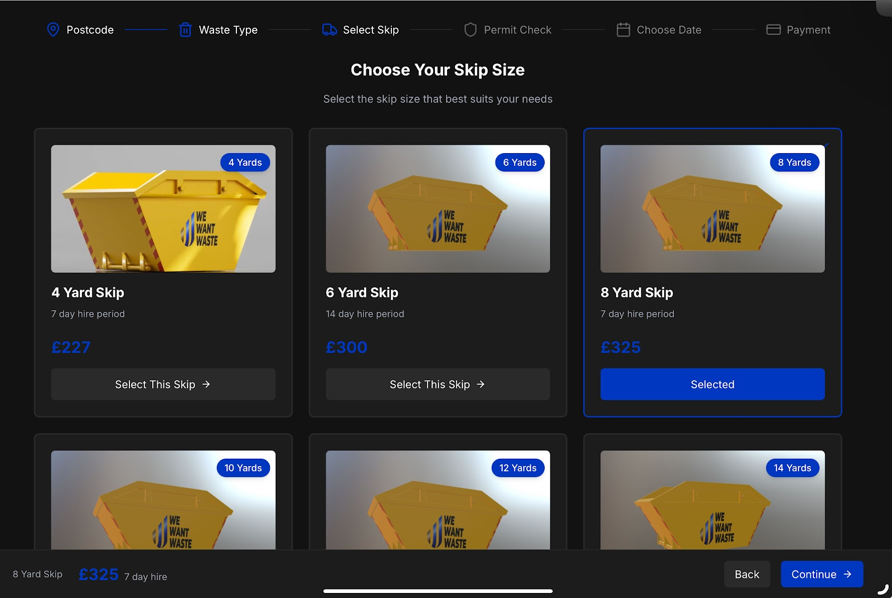

# 72-hr React Coding Challenge (REMWaste)

## Goal

Your goal is to redesign the whole page to look completely different from the original page. You should keep its functionality intact.

 

Focus on clean, maintainable react code, responsiveness, and UI/UX improvements.
You need to incorporate the page to display correctly on mobile web browser and desktop
Use the data from this link to populate the skip options https://app.wewantwaste.co.uk/api/skips/by-location?postcode=NR32&area=Lowestoft

## Approach

### Object Creation

I started by creating some basic objects, allowing for better modulation, consistency and deployability. These consisted of Classes designed to boost efficency and assist in future development. Additionally, a needed configuration file is created; allowing for easy management of components in the order process. 

#### WasteType

This is a simple JavaScript style `enum` which holds the possible WasteTypes in string format. This is to help with consistency; ensuring the same string is always used. 

#### Serialiser Classes
Serialiseable classes are incredibly useful when dealing with a frontend->backend relationship. With this, classes are defined to hold essential data that will eventually be translated to the backend. Thes classes come equipped with nested `toJSON()` functions, which return a data structure capable of being easily transferred using backend API. Additionally, these clases can also be initialised with a JSON structure; allowing for bi-directional data transfer. A side benefit of these front-end serialisation classes is the integration with a potential back-end database ORM.
> Whilst not included, these classses could also include validation functions- for example, ensuring that a skip size is selected before.

##### **Address**
The `Address` class holds typical location data (postcode, street, city, county). This object isnt used in the Skip Selection page, but is a demonstration of how the serialiser would behave in a wider setting.
 

##### **Order**
Similarly to the `Address`, `Order` holds the excess information like `skipSize`. This is where the selected skip in the Skip Selection comopnent is stored.

#### Configuration

### Context Creation

The use of these context windows is to provide a localised scope, giving access to variables and functions in multiple positions. The benefits of combining storage like this is that data remains consistent across the application.

#### Order Data:
`OrderContext` - [order_data.jsx](src\context\order_data.jsx): Providing an `Order` object to the necessasary components. 
This is accompanied by two functions, `setOrder` and `updateOrderField`; allowing the Order to be updated as a whole, or by individual feature. 
> An example of `updateOrderField` can be seen in [option.jsx](src\components\select_skip\option.jsx): line 22. Here, `skipSize` is updated to the size of the selected skip. 

#### Order Progress:
`OrderProgressContext` - [order_progress.jsx](src\context\order_progress.jsx): Providing two variables and three functions, this context is responsible for handling component changes using the `orderProcess` configuration. 

The `current_step` defines which component is loaded. Every time this value is updated, a `useEffect` hook changes `current_component` to the updated JSON structure in `orderProcess`. An added benefit of proceeding with this method is that by default, it only responds to changes in the step; meaning same value submissions are automatically ignored- reducing the number of times a component needs to be rendered. 

The three functions accompanying these variables in the context are `nextStep`, `prevStep`, and `updateStep`. These provide clipping; ensuring crashes do not occur as a result of exiting the bounds of `orderProcess`.

#### Skip Selection:
`SkipSelectionContext` - [skip_selection.jsx](src\context\skip_selection.jsx): Providing two key variables and one function, this context passes informaiton regarding the available skips to the necessasary components. This context window is not only responsible for getting the availble skips from the API route, but also handles the navigation between which skip is currently selected in the sub-menu. 

`skips_Data` holds all of the JSON data received from the API route. This is then passed through the context to avoid unnecessasary calls to the backend whenever this data is needed.

`skipSelection` defines which skip option is currently selected. This is a `useState` which holds the JSON data regarding the skip which is currently selected in the menu.

`updateSkipSelection(neewSelection:number)` is a function which takes the container ID provided in its JSON, finds it's corrisponding JSON structure in the `skips_Data` and sets the new `skipSelection` via its `useState` `setSkipSelection()` function. 

> Whilst this function could make use of expanding the list of JSON strctures into a map using the skip ID, given the number of skips in the array it isnt required. This could be easily updated in the future if a significant number of skips were introduced; but for now, the volume isnt great enough to consider a race condition. 

### Progress Navigation

Next, i started work on the creation of the new [progress navigation bar](src\components\process_nav.jsx); allowing the user to navigate backwards. I stripped the icons, aiming to provide a sleek finish which blends together. This is inspired by a minimilistic interpertation of a slider effect, showing the left side of the active window as completed and the right side as "upcomming and unseen". 

#### Empty Component

### Skip Type Selection

### Skip Details View
